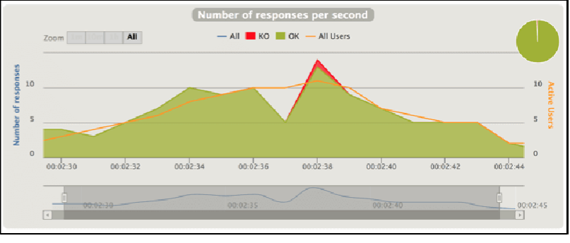
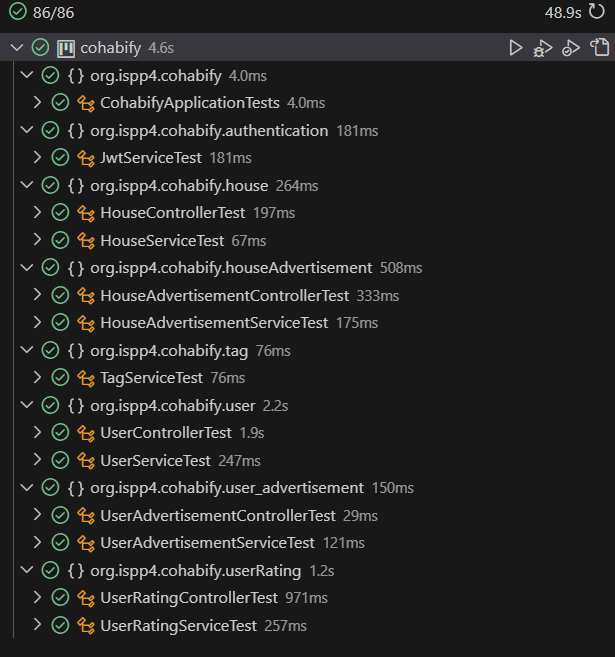
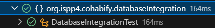
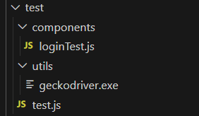
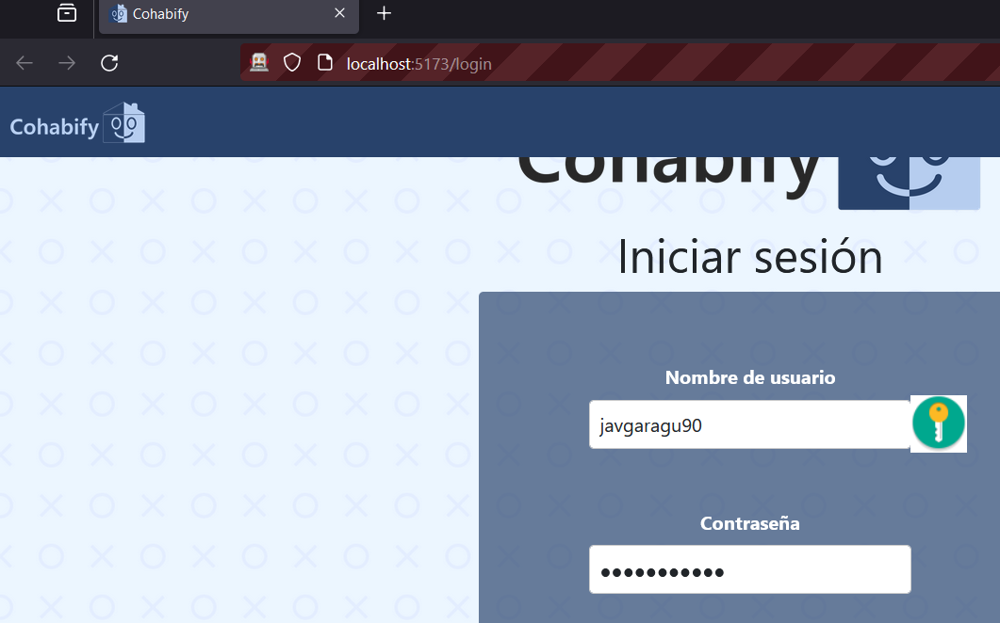
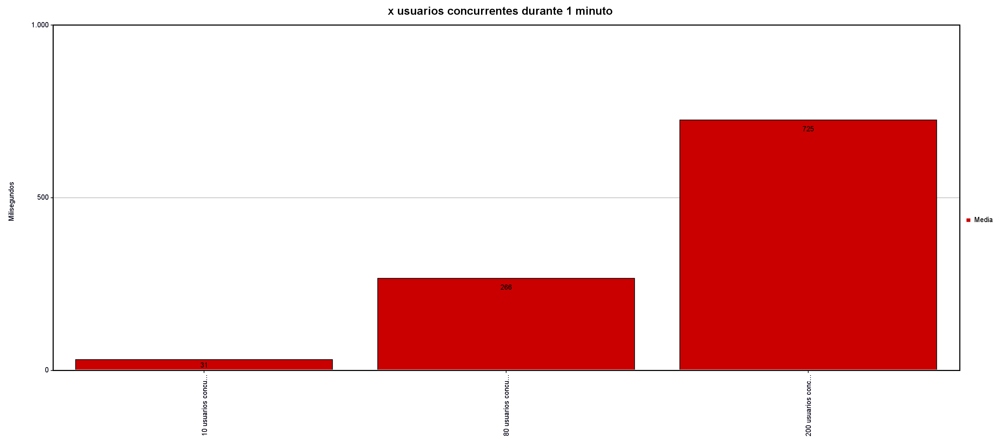
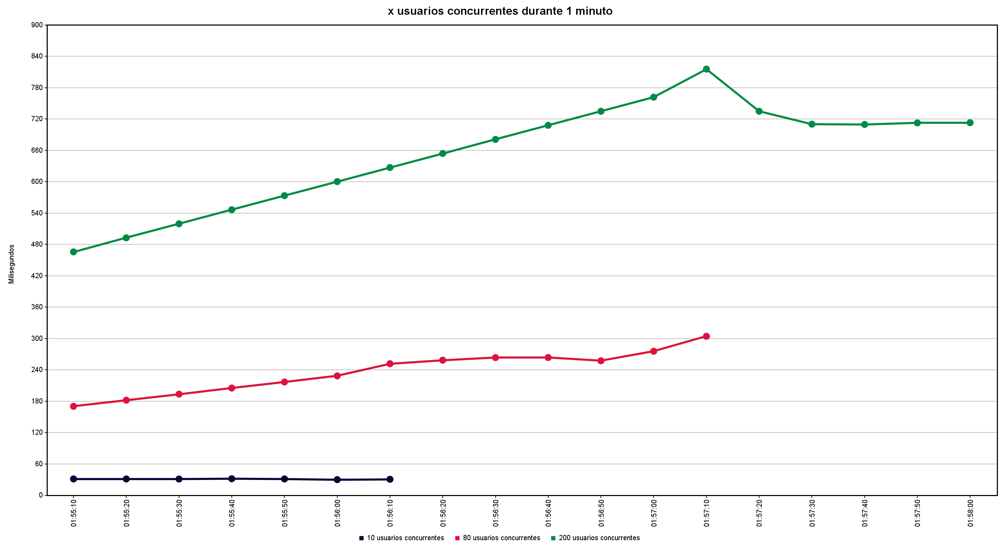
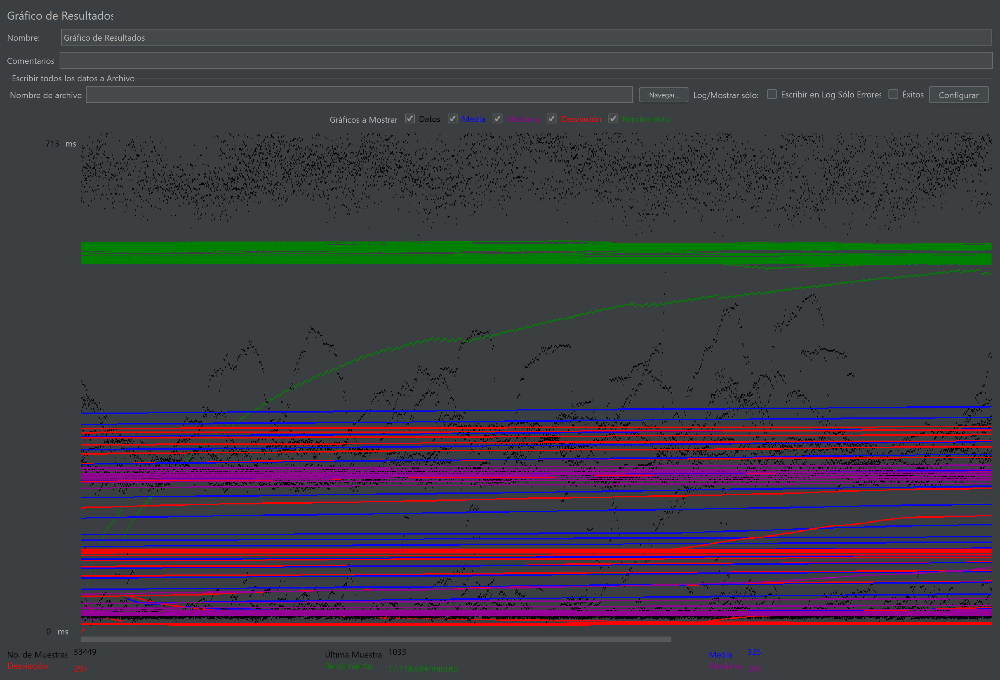

Plan de Pruebas
---


<table>
    <tbody>
        <tr>
            <td rowspan=2>Robles Russo, Eduardo (editor)<p></p>
            </td>
        </tr>
    </tbody>
</table>

<table>
  <tr>
    <th>Grupo</th>
    <th>4</th>
    <th>Entregable</th>
    <th>PPL</th>
  </tr>
  <tr>
    <td>Repositorio</td>
    <td colspan="3"><a href="https://github.com/Cohabify/Cohabify">https://github.com/Cohabify/Cohabify</a></td>
  </tr>
</table>

## Tabla de versiones
| Versión | Cambios | Autores |
| --- | --- | --- |
| V1.0 | Creación del documento | Eduardo Robles Russo |

### Tabla de Contenidos

- [Plan de Pruebas](#plan-de-pruebas)
  - [Versión Cambios Autores](#versión-cambios-autores)
  - [Tabla de Contenidos](#tabla-de-contenidos)
  - [1. Alcance:](#1-alcance)
  - [2. Estrategia de Pruebas:](#2-estrategia-de-pruebas)
  - [3. Recursos necesarios:](#3-recursos-necesarios)
  - [4. Casos de Prueba:](#4-casos-de-prueba)
  - [5. Criterios de Aceptación:](#5-criterios-de-aceptación)
  - [6. Resultados](#6-resultados)
  - [7. Conclusiones de los Resultados](#7-conclusiones-de-los-resultados)
  - [8. Aprobaciones](#8-aprobaciones)

### 1. Alcance:
   - Se probarán las funcionalidades descritas en los apuntes, incluyendo pruebas unitarias, de integración, de extremo a extremo, de aceptación y de rendimiento.
   - No se probarán aspectos fuera del alcance de la asignatura, como pruebas de seguridad avanzadas o pruebas de carga extremadamente pesadas.

### 2. Estrategia de Pruebas:

Para garantizar la calidad y robustez del software, seguiremos esta estrategia:

- **Pruebas de Camino Feliz y Pruebas Negativas:**
   - Realizaremos pruebas de camino feliz para validar el flujo principal de la aplicación.
   - También ejecutaremos pruebas negativas para verificar cómo el sistema maneja situaciones inesperadas o errores.

-  **Pruebas Manuales y Automáticas:**
   - Utilizaremos una combinación de pruebas manuales y automáticas:
       - **Pruebas Manuales**:
           - Realizaremos exploración manual para descubrir posibles problemas no cubiertos por casos de prueba específicos.
           - Validaremos la interfaz de usuario, flujos de trabajo y escenarios de uso.
       - **Pruebas Automáticas**:
           - Implementaremos pruebas automatizadas para casos repetitivos y regresiones.
           - Utilizaremos herramientas como Selenium, JUnit o PyTest para automatizar pruebas de UI y lógica de negocio.

-  **Casos de Prueba Específicos:**
   - Definiremos casos de prueba específicos para cada tipo de test:
       - **Pruebas Unitarias**:
           - Verificaremos funciones individuales y componentes a nivel de código.
           - Validaremos entradas válidas e inválidas.
       - **Pruebas de Integración**:
           - Probaremos la comunicación entre módulos y servicios.
           - Verificaremos la integración con bases de datos y APIs externas.
       - **Pruebas de Aceptación**:
           - Validaremos que el sistema cumpla con los requisitos del cliente.
           - Probaremos la usabilidad y la experiencia del usuario.
       - **Pruebas de Rendimiento**:
           - Estableceremos umbrales de rendimiento aceptables (tiempos de respuesta, capacidad de carga).
           - Ejecutaremos pruebas de carga y estrés para evaluar el rendimiento bajo diferentes condiciones.

### 3. Recursos necesarios:
   - Equipo de desarrollo: estudiantes de ingeniería de software responsables de implementar las pruebas.
   - Herramientas de prueba: Katalon Recorder, Selenium, JUnit 5, Gatling, entre otras.
   - Ambientes de prueba: entornos de desarrollo, preproducción y producción para pruebas de rendimiento.

### 4. Casos de Prueba:
Los casos de prueba son escenarios específicos diseñados para verificar el correcto funcionamiento de un software. Aquí estan las diferentes tipos de pruebas y los escenarios que se presentan en nuestra aplicacion.

- **Pruebas Unitarias**
  - **Objetivo**: Probar cada entidad de tenniendo en cuenta sus funciones de servicio y controlador cubriendo la cobertura de mas del 90% despues del analisis de SonarCloud.
    - **Escenarios**:
      - Hacer prueba de controller y service de  la entidad `authentication`
      - Hacer prueba de controller y service de  la entidad `chat`
      -  Hacer prueba de controller y service de  la entidad `house`
      -  Hacer prueba de controller y service de  la entidad `houseAdvertisement`
      -  Hacer prueba de controller y service de  la entidad `houseRating`
      -  Hacer prueba de controller y service de  la entidad `message`
      - Hacer prueba de controller y service de  la entidad `tag`
      - Hacer prueba de controller y service de  la entidad `user`
      - Hacer prueba de controller y service de  la entidad `userAdvertisement`
      - Hacer prueba de controller y service de  la entidad `userRating`

- **Pruebas de Integración**
  - **Objetivo**: Asegurar que la conexión con elementos externos funcione correctamente y que la información intercambiada se procese adecuadamente. No estamos probando de nuevo la lógica de tu aplicación, sino la interacción con otros sistemas. En este caso, utilizaremos la aplicación Cohabify.
  - **Escenarios**:
    - **Prueba de integración de base de datos**:
      1. Iniciar una base de datos.
      2. Conectar la aplicación Cohabify a la base de datos.
      3. Activar una función dentro del código de Cohabify que escriba datos en la base de datos.
      4. Verificar que los datos esperados se hayan escrito en la base de datos leyendo los datos de la base de datos.
    - **Prueba de integración de servicio externo**:
      1. Iniciar la aplicación Cohabify.
      2. Iniciar una instancia de cada servicio externo (Twilio, Google Maps, API de la sede electrónica del catastro) o un doble de prueba con la misma interfaz.
      3. Activar una función dentro del código de Cohabify que lea de la API de cada servicio externo.
      4. Verificar que la aplicación Cohabify puede analizar correctamente la respuesta de cada servicio externo.

- **Pruebas de Aceptación**
  - **Objetivo**: Verificar que el sistema cumpla con los requisitos del cliente descritos en los escenarios de aceptación. Probar la usabilidad y la experiencia del usuario en situaciones normales y de excepción.
  - **Escenarios**:
      - Ver el perfil del usuario y editarlo.
      - Publicar anuncios y verificar que sean visibles para otros usuarios.
      - Buscar anuncios de vivienda y aplicar filtros a la búsqueda.
      - Dejar comentarios en los anuncios de vivienda y confirmar que sean visibles para otros usuarios.
      - Ver un listado de anuncios de compañeros de piso y aplicar filtros a la búsqueda.
      - Dejar comentarios y dar “me gusta” en los perfiles de otros usuarios, y que estas interacciones sean visibles para otros usuarios.
      - Promocionar un anuncio y verificar que se pone en las primeras posiciones.

- **Pruebas de Rendimiento**
  - **Objetivo**: Realizar pruebas de carga para determinar el comportamiento del sistema bajo diferentes niveles de carga. Ejecutar pruebas de estrés para identificar el punto de quiebre del sistema y su capacidad de recuperación. Para estas pruebas usaremos la herramienta de JMeter porque Gatling la han puesto de pago.
  - **Escenarios**:
      - Evaluar la eficiencia del proceso de registro y edición de perfil.
      - Medir la rapidez en la publicación y visualización de anuncios.
      - Comprobar la agilidad en las búsquedas y filtrados de anuncios.
      - Validar que las interacciones en los perfiles de usuarios no afecten negativamente al rendimiento general de la plataforma.
  - **Umbrales de rendimiento**: Este tiene que cumplir con unos umbrales capacidad de manejo de carga y tiempo de respuesta maximo:

    - **Capacidad de manejo de carga:** Tendremos que obtener un umbral que iremos obteniendo con una herramienta llamada JMeter. Esta nos hara un grafico como en este ejemplo donde se ve con cuantos usuarios la aplicación falla:
      
    - **Tiempo de Carga de la Página Inicial**:
        - **Objetivo**: La página de inicio debe cargarse rápidamente para proporcionar una buena primera impresión.
        - **Umbral Aceptable**: Menos de **2 segundos** para cargar completamente la página principal.
    - **Tiempo de Carga de la Página Inicial**:
        - **Objetivo**: La página de inicio debe cargarse rápidamente para proporcionar una buena primera impresión.
        - **Umbral Aceptable**: Menos de **2 segundos** para cargar completamente la página principal.
    - **Tiempo de Respuesta de Búsquedas y Filtros**:
      - **Objetivo**: Las búsquedas y aplicaciones de filtros deben ser ágiles para mantener la experiencia del usuario.
      - **Umbral Aceptable**: Menos de **1 segundo** para mostrar resultados después de aplicar un filtro o realizar una búsqueda.

    - **Tiempo de Carga de Perfiles de Usuario y Anuncios**:
      - **Objetivo**: Los perfiles de usuario y los anuncios deben cargarse rápidamente para que los usuarios puedan acceder a la información relevante.
      - **Umbral Aceptable**: Menos de **1 segundo** para cargar un perfil de usuario o un anuncio.

    - **Tiempo de Carga de Imágenes y Contenido Multimedia**:
      - **Objetivo**: Las imágenes y otros elementos multimedia deben cargarse sin demoras significativas.
      - **Umbral Aceptable**: Menos de **2 segundos** para cargar imágenes y contenido multimedia en una página.

    - **Tiempo de Inicio de Sesión y Autenticación**:
      - **Objetivo**: El proceso de inicio de sesión debe ser rápido y eficiente.
      - **Umbral Aceptable**: Menos de **3 segundos** para completar el inicio de sesión.

    - **Tiempo de Publicación de Anuncios y Comentarios**:
      - **Objetivo**: Los usuarios deben poder publicar anuncios y dejar comentarios sin retrasos notables.
      - **Umbral Aceptable**: Menos de **2 segundos** para completar la publicación o el comentario.

### 5. Criterios de Aceptación:
   - Las pruebas se considerarán exitosas si todas las funcionalidades probadas cumplen con los criterios de aceptación definidos. Estos criterios ayudarán a garantizar que la aplicación cumpla con los estándares de calidad y satisfaga las necesidades de los usuarios:
      
      - **Registro de Usuario:**
        - **Given** un usuario no registrado  
        - **When** el usuario completa el formulario de registro con información válida  
        - **Then** el usuario debería recibir una confirmación de registro exitoso  

      - **Inicio de Sesión:**
        - **Given** un usuario registrado  
        - **When** el usuario inicia sesión con credenciales válidas  
        - **Then** el usuario debería poder acceder a su cuenta  

      - **Perfil de Usuario:**
        - **Given** un usuario autenticado  
        - **When** el usuario accede a la página de perfil  
        - **Then** el usuario debería poder ver y editar su información  

      - **Publicación de Anuncios:**
        - **Given** un usuario con el rol de propietario  
        - **When** el usuario elige un plan y publica una propiedad  
        - **Then** la propiedad debería aparecer correctamente en la plataforma  

      - **Edición y Eliminación de Anuncios:**
        - **Given** un usuario propietario con anuncios publicados  
        - **When** el usuario edita o elimina un anuncio  
        - **Then** los cambios deberían reflejarse correctamente en la plataforma  

      - **Promoción de Anuncios:**
        - **Given** un usuario propietario con un anuncio publicado  
        - **When** el usuario promociona el anuncio  
        - **Then** el anuncio debería destacarse y mostrar cambios visuales  

      - **Chat entre Usuarios:**
        - **Given** un usuario interesado en un anuncio  
        - **When** el usuario inicia un chat con el propietario  
        - **Then** los mensajes deberían enviarse y recibir respuestas adecuadas  

      - **Adquisición de Planes:**
        - **Given** un usuario autenticado  
        - **When** el usuario adquiere un plan (owner/explorer)  
        - **Then** el usuario debería tener acceso a las funcionalidades asociadas al plan  

      - **Pago Adicional por Anuncio:**
        - **Given** un usuario propietario con el plan básico  
        - **When** el usuario publica anuncios adicionales  
        - **Then** se debe aplicar un cargo de 5 euros por cada anuncio adicional  

      - **Funcionalidad de Street View:**
        - **Given** un usuario en la página de detalles de una propiedad  
        - **When** el usuario accede a la vista de mapa y Street View  
        - **Then** se debería mostrar la ubicación de la propiedad en el mapa y en Street View  

      - **Solicitud de Derecho al Olvido:**
        - **Given** un usuario autenticado  
        - **When** el usuario solicita eliminar su cuenta  
        - **Then** la cuenta del usuario debería ser eliminada y todos los datos asociados borrados  
  - Criterios de aceptacion según al plan que estan suscritos. Estos criterios son necesarios especificarlos para que quede constancia al desarrollador que estas se deben pruebas de aceptación se deben realizar:


| Tipo de cliente | Criterio de aceptación |
| --- | --- |
| **Usuario registrado** | Cuando un usuario registrado paga 3€, su publicación se destaca durante 24 horas, apareciendo con prioridad en las búsquedas de los usuarios. |
| **Plan Propietario (15€ base + 5€ por vivienda adicional)** | Cuando un usuario se suscribe al Plan Propietario, puede gestionar sus viviendas publicadas, obtener información valiosa, facilitar la comunicación, aumentar la visibilidad de sus publicaciones, y recibir estadísticas detalladas. Además, puede promocionar gratuitamente una publicación por cada vivienda que gestione al mes (durante 24 horas) y tiene acceso a chats ilimitados. |
| **Plan Explorador (5€)** | Cuando un usuario se suscribe al Plan Explorador, puede abrir chats ilimitados (inicialmente limitado a abrir un máximo de 3 chats en paralelo), visualizar todas las publicaciones con un día de antelación, y se distingue de los usuarios normales mediante un identificador visual de verificado. Este plan está limitado a una única publicación por usuario. |

### 6. Resultados

- **Pruebas unitarias:**
  - Vemos que las pruebas de las entidades que llevamos cubiertas todas pasan las pruebas unitarias teniendo pruebas tanto de servicio como de controlador:


- **Pruebas de Integración**

  - **Prueba de integración de base de datos** En las pruebas a la base de datos podemos ver este output de la prueba:

  ```code
  false,1,DatabaseIntegrationTest,,[engine:junit-jupiter]/[class:org.ispp4.cohabify.databaseIntegration.DatabaseIntegrationTest]
  %TSTTREE3,testDatabaseWrite(org.ispp4.cohabify.databaseIntegration.DatabaseIntegrationTest),false,1,false,2,testDatabaseWrite(),,[engine:junit-jupiter]/[class:org.ispp4.cohabify.databaseIntegration.DatabaseIntegrationTest]/[method:testDatabaseWrite()]
  %TESTS  3,testDatabaseWrite(org.ispp4.cohabify.databaseIntegration.DatabaseIntegrationTest)
  %TESTE  3,testDatabaseWrite(org.ispp4.cohabify.databaseIntegration.DatabaseIntegrationTest)
  ```
  

- **Pruebas de aceptacion:** 
  - Se abre el modal despues de ejecutar `npm run test`. El email se ha rellenado correctamente. Hace uso de selenium para navegar a la pagina de login y introducir el usuario y contraseña viendo que este se logea con el usuario correctamente y tambien viendo si se puede logear con Google.
  
  Visualización de como se abre el modal con el usuario y la contraseña que especificamos anteriormente en el loginTest.js:
  

- **Pruebas de rendimiento** Podemos hacer una estimación aproximada del número máximo de usuarios concurrentes.

  - Para el **frontend**, estamos utilizando Netlify con un plan que permite un tráfico total de 1 TB al mes. Si estimamos que cada petición tiene un tamaño medio de 500 KB, esto significa que puedes realizar alrededor de 2.000.000 de solicitudes al mes. Si suponemos que cada usuario realiza unas 190 peticiones, esto te daría alrededor de 10.500 usuarios al mes.

  - Para el **backend**, estás utilizando Heroku con un plan que activa hasta 3 Dynos durante las horas pico (10:00 a 14:00). Aunque el número exacto de usuarios que pueden ser atendidos por un Dyno puede variar dependiendo de la naturaleza de las solicitudes y la eficiencia de tu aplicación, una estimación conservadora podría ser alrededor de 50-100 usuarios por Dyno. Esto te daría un máximo de 150-300 usuarios concurrentes durante las horas pico.

  - Para la **base de datos**, estás utilizando MongoDB Atlas con un plan que te permite realizar un total de 2.000.000 de peticiones Post y Put al mes. Si suponemos que cada usuario realiza unas 190 de estas peticiones al mes, esto te daría alrededor de 10.500 usuarios al mes.

  Por lo tanto, basándonos en estas estimaciones, el número máximo de usuarios concurrentes en tu sitio web estaría limitado por el backend durante las horas pico, que es de alrededor de 150-300 usuarios. Tambien hemos hecho estas graficas de JMeter con 10, 80 y 200 usuarios concurrentes:
  
  
  


### 7. Conclusiones de los Resultados
   - Se documentarán los resultados de las pruebas, incluyendo cualquier error encontrado y las acciones correctivas tomadas.
   - Se realizará un análisis de los resultados para identificar áreas de mejora y posibles problemas pendientes.

### 8. Aprobaciones
   - Se solicitarán las firmas de los GM para validar el plan de pruebas y los resultados obtenidos. Estas son sus firmas:

<tr>
    <td></td>
    <td></td>
    <td></td>
    <td></td>
</tr>
