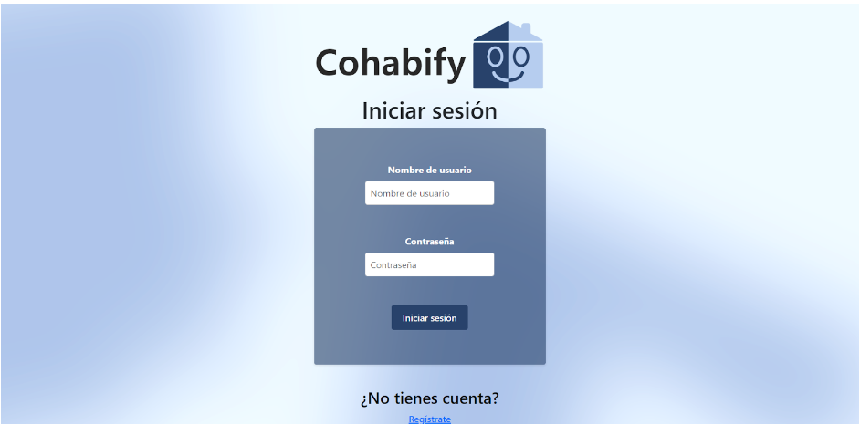
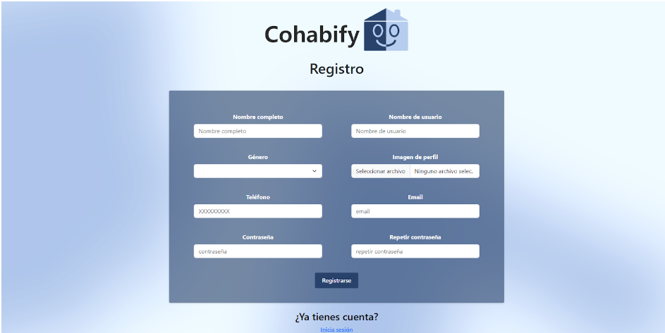
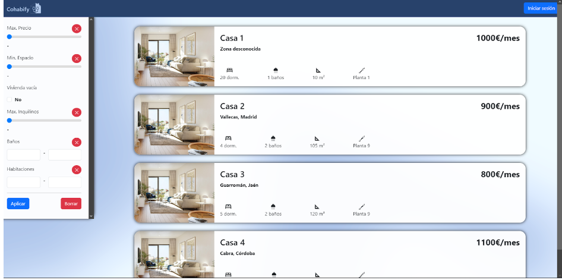
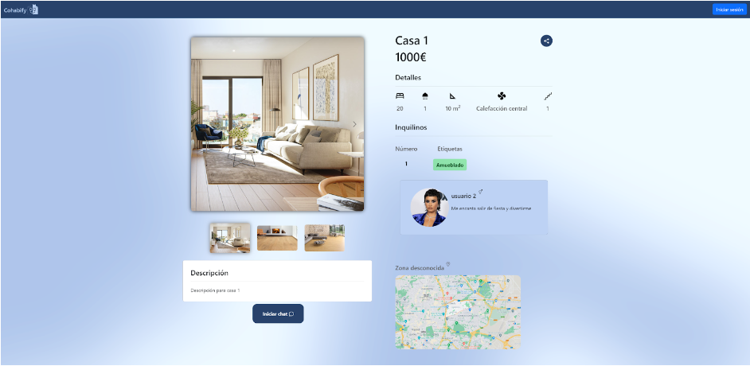
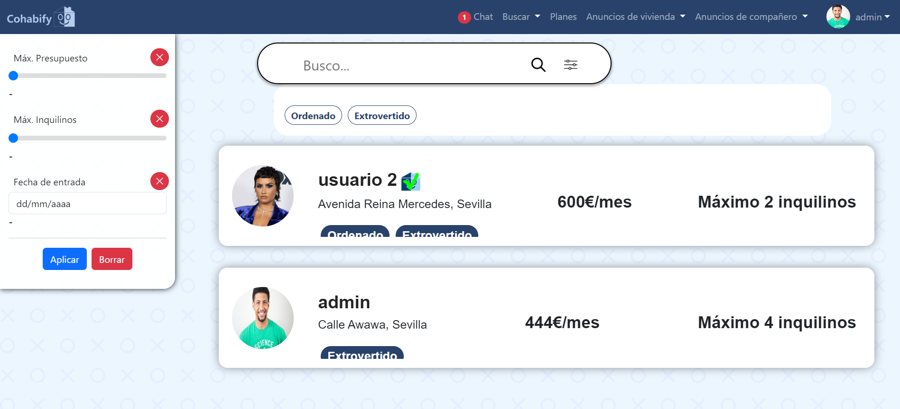
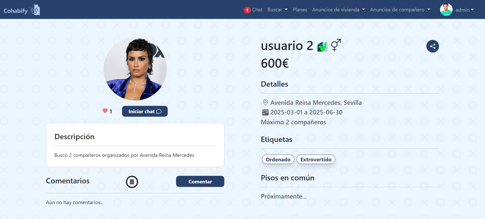
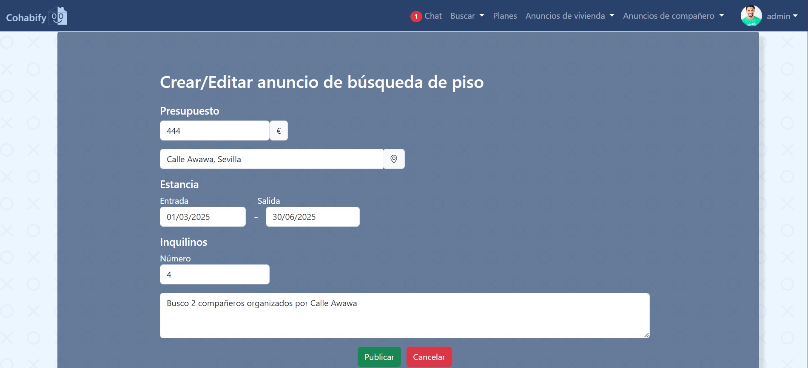
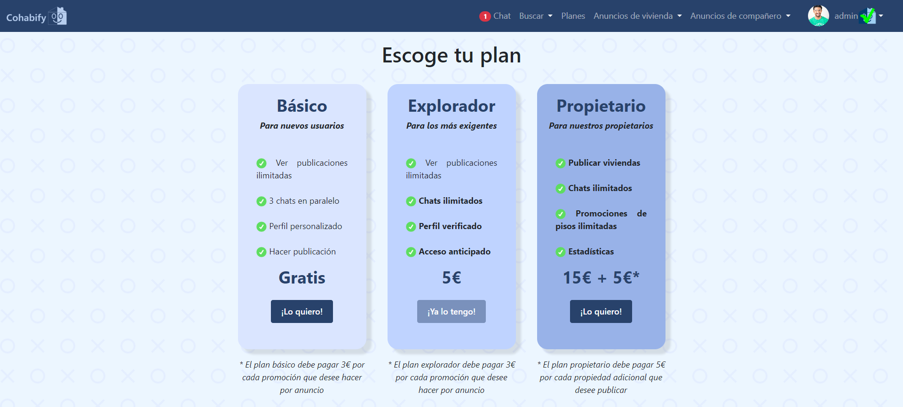
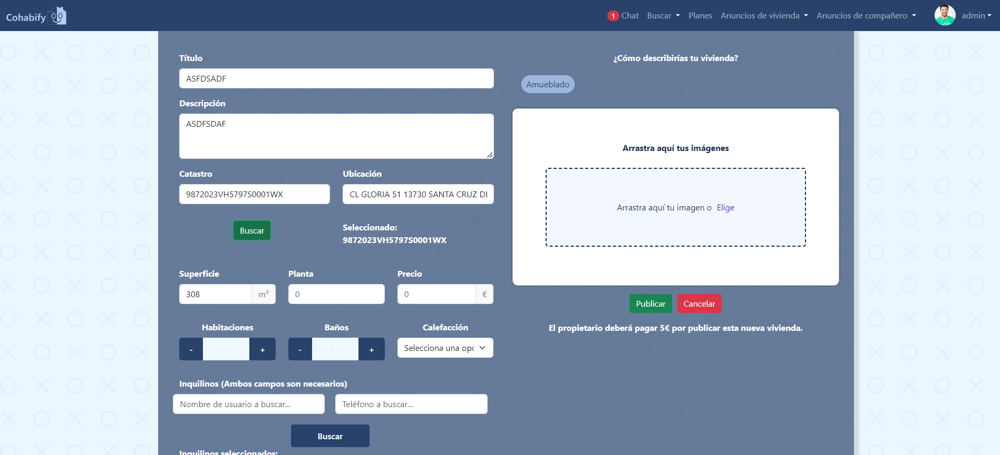
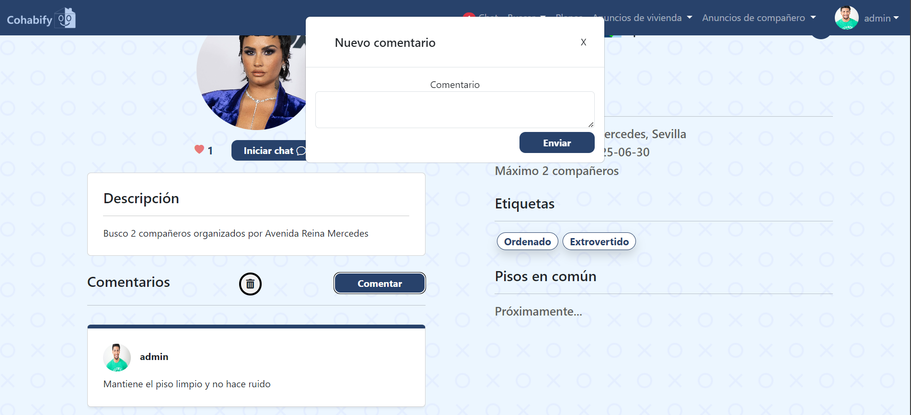

Software Guidelines
---

<table>
    <tbody>
        <tr>
            <td rowspan=2>
 González Castillero, Rafael (editor) 

            Morato Navarro, Juan Carlos (revisor)

 Urquijo Martínez, Álvaro (editor)

            </td>
        </tr>
    </tbody>
</table>

<table>
  <tr>
    <th>Grupo</th>
    <th>4</th>
    <th>Entregable</th>
    <th>S2</th>
  </tr>
  <tr>
    <td>Repositorio</td>
    <td colspan="3"><a href="https://github.com/Cohabify/Cohabify">https://github.com/Cohabify/Cohabify</a></td>
  </tr>
  <tr>
    <td>Base de conocimiento común</td>
    <td colspan="3"><a href="https://bgcc.vercel.app/">https://bgcc.vercel.app/</a></td>
  </tr>
</table>

## Versión Cambios Autores

| Versión | Cambios | Autores |
| --- | --- | --- |
| V1.0 | Creación del documento | Rafael González Castillero |
| V2.0 | Actualización del documento | Álvaro Urquijo Martínez |

## Tabla de contenidos
- [Software Guidelines](#software-guidelines)
- [Versión Cambios Autores](#versión-cambios-autores)
- [Tabla de contenidos](#tabla-de-contenidos)
- [Resumen ejecutivo](#resumen-ejecutivo)
- [1. Manual de uso](#1-manual-de-uso)
  - [1.1 CU Registro y Login](#11-cu-registro-y-login)
    - [1.1.1 Inicio de sesión](#111-inicio-de-sesión)
    - [1.1.2 Registro](#112-registro)
  - [1.2 CU Listar viviendas](#12-cu-listar-viviendas)
  - [1.3 CU Detalles de una vivienda](#13-cu-detalles-de-una-vivienda)
  - [1.4 CU Listar inquilinos](#14-cu-listar-inquilinos)
  - [1.5 CU Detalles de usuario](#15-cu-detalles-de-usuario)
  - [1.6 CU Crear o editar anuncio publicado](#16-cu-crear-o-editar-anuncio-publicado)
  - [1.7 CU Planes de servicio](#17-cu-planes-de-servicio)
  - [1.8 CU Crear anuncio de piso](#18-cu-crear-anuncio-de-piso)
  - [1.9 CU Comentarios](#19-cu-comentarios)

- [2. Datos adicionales](#2-datos-adicionales)

## Resumen ejecutivo
A continuación, se mostrarán los casos de uso core de la aplicación, con muestras de las diferentes vistas y su correspondiente funcionamiento. Además, se aportan los enlaces al repositorio, página de despliegue, landing page y las credenciales para el inicio de sesión.

## 1. Manual de uso

## 1.1 CU Registro y Login

### 1.1.1 Inicio de sesión

En el inicio de sesión, si se ha registrado una cuenta previamente solamente hay que introducir las credenciales con las que se ha registrado.

### 1.1.2 Registro

En el registro, introduzca los datos que desee para realizar el registro, es importante mencionar que ninguno de los campos se puede dejar vacío y que el número de teléfono debe ser un número de nueve dígitos.

## 1.2 CU Listar viviendas

En la pantalla se observa el listado de viviendas publicadas en la página web. A la izquierda, hay varios filtros que podemos usar para guiar nuestra búsqueda, aunque en el S1 todavía no son funcionales.
Al hacer click en cualquiera de las viviendas, se redirige a la pantalla de detalles de dicha vivienda.

## 1.3 CU Detalles de una vivienda

En esta pantalla se muestran los detalles de la vivienda. Para navegar entre las fotos de esta se puede pulsar en las flechas que hay a ambos lados de la que se está mostrando ampliada o bien pulsando en la propia foto.
Próximamente se podrá iniciar chat para realizar el matchmaking, por ahora no es posible. En un futuro también será posible pinchar en el usuario para ver su perfil.
Arriba a la derecha, está el icono de compartir el cual al pulsarlo pondrá en el portapapeles del usuario la URL de la vivienda.

## 1.4 CU Listar inquilinos

En esta pantalla se encuentra el listado de usuarios. Esta muestra la foto, el nombre de usuario, su foto de perfil y las etiquetas. Además, hay una barra de búsqueda que en un futuro será funcional, y si pulsamos en el icono del final de la barra, podremos ver los filtros  de etiquetas así como otros filtros como el presupuesto o el maximo de inquilinos. Si pulsamos en las etiquetas, se filtrarán los usuarios con esas etiquetas, pudiendo elegir más de una.

## 1.5 CU Detalles de usuario

En esta vista, se pueden ver los detalles de perfil del usuario que seleccionemos. 
Desde aquí se puede acceder a varias funcionalidades: la primera es comentar, lo cual será posible después de interactuar con el usuario, además estará disponible la posibilidad de dar like a este, aumentando la cuenta que se ve cpn el icono del corazón. La segunda es iniciar chat, permitiéndonos hablar con el usuario con el fin de convivir con él, esta funcionalidad aún no ha sido añadida.
Por último, mencionar que también se contará con pisos en común, que son aquellos pisos a los que ambos usuarios le hayan dado me gusta.

## 1.6 CU Crear o editar anuncio publicado

En esta vista podemos crear un anuncio de búsqueda de piso o editarlo en el caso de que ya hubieramos creado uno anteriormente. 
Deade aquí se puede indicar el presupuesto disponible, asi como datos de entrada y salida del piso, número máximo de inquilinos y un comentario.

## 1.7 CU Planes de servicio

En esta vista podemos escoger el plan que consideremos adecuado a nuestras necesidades, indicando las características de dicho plan y remarcando en negrita las que incluye en adición al plan básico.
Por ahora el botón de selección no redirige a una pasarela de pago.

## 1.8 CU Crear anuncio de piso

En esta vista podemos crear un anuncio de vivienda, solo disponible para usuarios con el plan Propietario, en esta se deberán indicar datos como el titulo, numero de habitaciones y baños, imagenes, inquilinos, entre otras.
También se puede indicar el numero del Catastro y se autorellenará la ubicacion y superficie de la vivienda.

## 1.9 CU Comentarios

Tanto en la vista de detalles de usuario como en la de detalles de piso se puede dejar un comentario sobre el usuario, los comentarios se mostrarán debajo del perfil indicando el usuario que ha dejado dicho comentario.

## 2. Datos adicionales
Url Landing Page: `https://cohabify.github.io/`
Url plataforma de despliegue: `https://cohabify.onrender.com`
Url repositorio con el código: `https://github.com/Cohabify/Cohabify`

Credenciales para inicio de sesión: admin, admin
