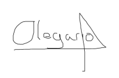

Compromiso de participación
---

<table>
    <tbody>
        <tr>
            <td rowspan=2>Arriaza Arriaza, Daniel (editor)

 Barrera García, Ismael (editor)

 Calero López, Marina (editor)

 Galeano de Paz, Guillermo (editor)

 González Castillero, Rafael (editor)

 Márquez Sierra, María (editor)

 Márquez Soldán, María (editor)
            </td>
            <td rowspan=2>Morato Navarro, Juan Carlos (revisor,editor) 

 Morato Navarro, Olegario (editor)

 Robles Russo, Eduardo (editor)

 Roldán García, Miguel Ángel (editor)

 Romero González, Juan (editor)

 Urquijo Martínez, Álvaro (editor)

            </td>
        </tr>
    </tbody>
</table>

<table>
  <tr>
    <th>Grupo</th>
    <th>4</th>
    <th>Entregable</th>
    <th>S2</th>
  </tr>
  <tr>
    <td>Repositorio</td>
    <td colspan="3"><a href="https://github.com/Cohabify/Cohabify">https://github.com/Cohabify/Cohabify</a></td>
  </tr>
  <tr>
    <td>Base de conocimiento común</td>
    <td colspan="3"><a href="https://bgcc.vercel.app/">https://bgcc.vercel.app/</a></td>
  </tr>
</table>

## Compromiso de Participación en la Asignatura ISPP (Ingeniería del Software y Práctica Profesional) - Curso 2023-24

Fecha: 04/03/2024
Grupo de Trabajo: 4

**Compromiso**: Los aquí presentes, al incorporarse a la asignatura de Ingeniería de Software y Práctica Profesional (ISPP) para el curso 2023-24, se comprometen a cumplir con los siguientes requisitos y condiciones como miembros activos del grupo de trabajo, compuesto por 13 personas:
Dedicación de Tiempo: Me comprometo a dedicar un esfuerzo de 6 horas semanales a las actividades y tareas asignadas en el marco de la asignatura.

- Compromiso de Esfuerzo: Soy consciente de que, si mi esfuerzo no 
alcanza al menos el 80% de lo requerido, me retiraré voluntariamente del grupo para no obstaculizar el progreso del mismo.

- Finalización de Tareas: Me obligo a finalizar mis tareas asignadas a tiempo, especialmente en aquellos casos en los que el incumplimiento de mis responsabilidades pueda resultar en la necesidad de que mis compañeros trabajen en días festivos.

- Registro de Tiempo: Acuerdo en registrar el tiempo dedicado a cada tarea utilizando la herramienta Clockify, proporcionando el detalle necesario para cada tarea según se requiera.

- Compromiso de trabajo coordinado: Me comprometo a que cuando se trabaje en grupos / parejas, participaré activamente en el trabajo que se esté realizando, de forma que evitemos que haya personas inactivas en este tipo de entornos mientras el otro compañero trabaja. Maximizando así la eficiencia del tiempo dedicado al proyecto.

- Compromiso de atención: Me comprometo a atender en clases y reuniones para agilizar el trabajo fuera de las mismas y mantenerme al día sobre el estado del trabajo de mis compañeros. 
- Compromiso de asistencia: Me comprometo a asistir al mayor número de clases y reuniones posible con tal de que los conocimientos aportados por la asignatura lleguen a todos por igual.

- Compromiso de aspiración: Comprendo que mi objetivo con este proyecto es realizar un trabajo con el que conseguiría obtener una nota de 10 en la asignatura. Por lo cual si en algún momento mi esfuerzo en una semana no llegará al 80% de lo que se requiere y quisiera mantenerme en el equipo, la próxima semana realizaría un 120% como compensación.

Al firmar este documento, entiendo y acepto las responsabilidades que se me han asignado y me comprometo a cumplirlas según lo establecido en este compromiso.

Firma de los interesados:
Arriaza Arriaza, Daniel

Barrera García, Ismael

Calero López, Marina

Galeano de Paz, Guillermo

González Castillero, Rafael

Márquez Sierra, María

Márquez Soldán, María

Morato Navarro, Juan Carlos

Morato Navarro, Olegario

Robles Russo, Eduardo

Roldán García, Miguel Ángel

Romero González, Juan

Urquijo Martínez, Álvaro
