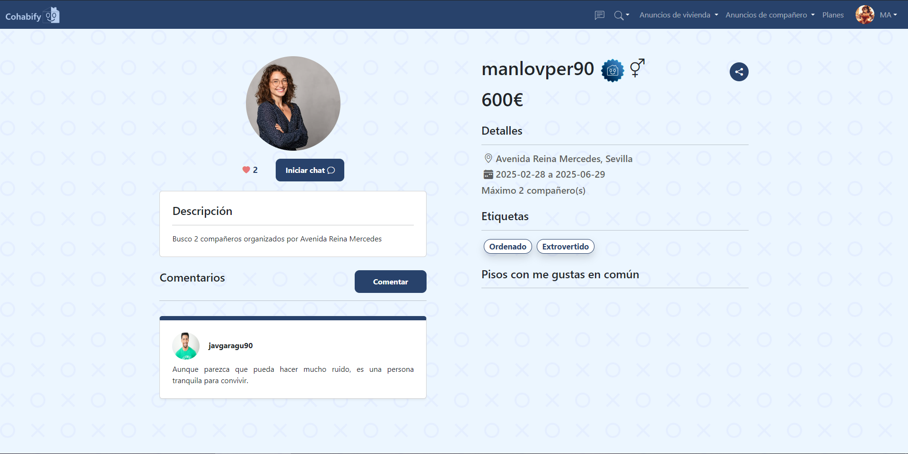
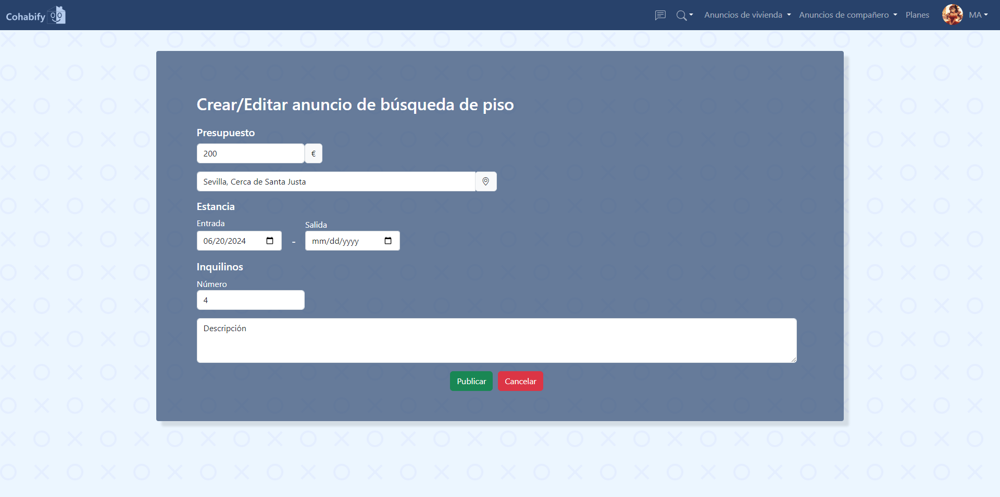

Software Guidelines
---

<table>
    <tbody>
        <tr>
            <td rowspan=2>
 González Castillero, Rafael (editor) 

            
Morato Navarro, Juan Carlos (revisor)

Morato Navarro, Olegario (revisor)

 Urquijo Martínez, Álvaro (editor)

            
Miguel Ángel Roldán García (editor)

            </td>
        </tr>
    </tbody>
</table>

<table>
  <tr>
    <th>Grupo</th>
    <th>4</th>
    <th>Entregable</th>
    <th>WPL</th>
  </tr>
  <tr>
    <td>Repositorio</td>
    <td colspan="3"><a href="https://github.com/Cohabify/Cohabify">https://github.com/Cohabify/Cohabify</a></td>
  </tr>
</table>

## Tabla de versiones

| Versión | Cambios | Autores |
| --- | --- | --- |
| V1.0 | Creación del documento | Rafael González Castillero |
| V2.0 | Actualización del documento | Álvaro Urquijo Martínez |
| V3.0 | Actualización del documento | Miguel Ángel Roldán García |

## Tabla de contenidos
- [Software Guidelines](#software-guidelines)
- [Versión Cambios Autores](#versión-cambios-autores)
- [Tabla de contenidos](#tabla-de-contenidos)
- [Resumen ejecutivo](#resumen-ejecutivo)
- [1. Manual de uso](#1-manual-de-uso)
  - [1.1 CU Registro y Login](#11-cu-registro-y-login)
    - [1.1.1 Inicio de sesión](#111-inicio-de-sesión)
    - [1.1.2 Registro](#112-registroegistro)
  - [1.2 CU Listar viviendas](#12-cu-listar-viviendas)
  - [1.3 CU Detalles de una vivienda](#13-cu-detalles-de-una-vivienda)
  - [1.4 CU Listar inquilinos](#14-cu-listar-inquilinos)
  - [1.5 CU Detalles de usuario](#15-cu-detalles-de-usuario)
  - [1.6 CU Crear o editar anuncio publicado](#16-cu-crear-o-editar-anuncio-publicado)
  - [1.7 CU Planes de servicio](#17-cu-planes-de-servicio)
  - [1.8 CU Pasarela de pago](#18-cu-pasarela-de-pago)
  - [1.9 CU Crear anuncio de piso](#19-cu-crear-anuncio-de-piso)
  - [1.10 CU Comentarios](#110-cu-comentarios)
  - [1.11 CU Chat](#111-cu-chat)
  - [1.12 CU Promocionar anuncio](#112-cu-promocionar-anuncio)
  - [1.13 CU Mapa](#113-cu-mapa)

- [2. Datos adicionales](#2-datos-adicionales)

## Resumen ejecutivo
A continuación, se mostrarán los casos de uso core de la aplicación, con muestras de las diferentes vistas y su correspondiente funcionamiento. Además, se aportan los enlaces al repositorio, página de despliegue, landing page y las credenciales para el inicio de sesión.

## 1. Manual de uso

## 1.1 CU Registro y Login

### 1.1.1 Inicio de sesión

En el inicio de sesión, si se ha registrado una cuenta previamente solamente hay que introducir las credenciales con las que se ha registrado. Alternativamente, se podrá iniciar sesión con una cuenta de correo de Google.

### 1.1.2 Registro

En el registro, introduzca los datos que desee para realizar el registro, es importante mencionar que ninguno de los campos se puede dejar vacío y que el número de teléfono debe ser un número de nueve dígitos. En caso de haber intentado iniciar sesión con Google, no tendremos que introducir el correo y tampoco la contraseña, pues se asignará una segura aleatoria que podremos cambiar en cualquier momento tras iniciar sesión.

Tras finalizar, le será enviado un correo electrónico a la dirección proporcionada con un enlace para activar su cuenta.

## 1.2 CU Listar viviendas

En la pantalla se observa el listado de viviendas publicadas en la página web. A la izquierda, hay varios filtros que podemos usar para guiar nuestra búsqueda.
Al hacer click en cualquiera de las viviendas, se redirige a la pantalla de detalles de dicha vivienda.

## 1.3 CU Detalles de una vivienda

En esta pantalla se muestran los detalles de la vivienda. Para navegar entre las fotos de esta se puede pulsar en las flechas que hay a ambos lados de la que se está mostrando ampliada o bien pulsando en la propia foto.
Próximamente se podrá iniciar chat para abrir un chat privado con los inquilinos de la vivienda y el autor del anuncio.
Arriba a la derecha, está el icono de compartir el cual al pulsarlo pondrá en el portapapeles del usuario la URL de la vivienda.

## 1.4 CU Listar inquilinos

En esta pantalla se encuentra el listado de usuarios. Esta muestra la foto, el nombre de usuario, su foto de perfil y las etiquetas. Además, hay una barra de búsqueda y si pulsamos en el icono del final de la barra, podremos ver los filtros  de etiquetas así como otros filtros como el presupuesto o el máximo de inquilinos. Si pulsamos en las etiquetas, se filtrarán los usuarios con esas etiquetas, pudiendo elegir más de una.

## 1.5 CU Detalles de usuario

En esta vista, se pueden ver los detalles de perfil del usuario que seleccionemos. 
Desde aquí se puede acceder a varias funcionalidades: la primera es comentar, además estará disponible la posibilidad de dar like a este, aumentando la cuenta que se ve con el icono del corazón. La segunda es iniciar chat, permitiéndonos hablar con el usuario con el fin de contactar con él.
Por último, mencionar que también se contará con pisos en común, que son aquellos pisos a los que ambos usuarios le hayan dado me gusta.

## 1.6 CU Crear o editar anuncio publicado

En esta vista podemos crear un anuncio de búsqueda de piso o editarlo en el caso de que ya hubieramos creado uno anteriormente. 
Desde aquí se puede indicar el presupuesto disponible, así como datos de entrada y salida del piso, número máximo de inquilinos y una descripción.

## 1.7 CU Planes de servicio

En esta vista podemos escoger el plan que consideremos adecuado a nuestras necesidades, indicando las características de dicho plan y remarcando en negrita las que incluye en adición al plan básico.
El botón de selección redirige a una pasarela de pago.

## 1.8 CU Pasarela de pago

Todos los pagos por los servicios de Cohabify, se realizarán a través de la interfaz externa de Stripe. Actualmente se encuentra en modo prueba y aceptará valores aleatorios sin verificarlos. A excepción de la tarjeta de crédito, que habremos de usar el número 4242 4242 4242 4242 para usar una tarjeta de prueba de España.

## 1.9 CU Crear anuncio de piso

En esta vista podemos crear un anuncio de vivienda, sólo disponible para usuarios con el plan Propietario, en esta se deberán indicar datos como el titulo, número de habitaciones y baños, imagenes, inquilinos, entre otras.
También se puede indicar el numero del Catastro y se autorellenará la ubicación y superficie de la vivienda. Un número de catastro válido para pruebas es: 9872023VH5797S0001WX

## 1.10 CU Comentarios

Tanto en la vista de detalles de usuario como en la de detalles de piso se puede dejar un comentario sobre el usuario, los comentarios se mostrarán debajo del perfil indicando el usuario que ha dejado dicho comentario y la valoración en estrellas, en el caso de las viviendas.

## 1.11 CU Chat

La pantalla de chat nos mostrará un listado de nuestros chats a la izquierda. Haciendo click en cualquiera de ellos, se abrirá ese chat y podremos leer o enviar mensajes, haciendo uso de la interfaz en el lado derecho de la pantalla. Tanto en el listado como en el encabezado del chat, podremos ver las fotos de hasta 2 de los miembros del chat y los nombres de todos los participantes.

## 1.12 CU Promocionar anuncio

Para promocionar un anuncio, se debe pulsar en el botón de promocionar, mostrando una pantalla de pasarela de pago de Stripe. Pagándo 3 euros el anuncio quedará destacado arriba de la lista de búsqueda con cambios visuales.

## 1.13 CU Mapa        

        

Se ha añadido una funcionalidad para ver la ubicación de los pisos en el mapa desde la página de inicio y desde la página de detalles de piso. También se ha añadido el mapa en el formulario de crear anuncios de viviendas para poder añadir una marca en el mapa y poder mostrarlo después a los demás usuarios.  

## 2. Datos adicionales
Url Landing Page: `https://cohabify.github.io/`
Url plataforma de despliegue: `https://s3-v2-cohabify.onrender.com/`
Url repositorio con el código: `https://github.com/Cohabify/Cohabify`

Credenciales para inicio de sesión: 
- Nombre de usuario: manlovper90; Contraseña: manlovper90
- Nombre de usuario: javgaragu90; Contraseña: javgaragu90

Pedimos que no se modifiquen las credenciales de estos usuarios, muchas gracias.
