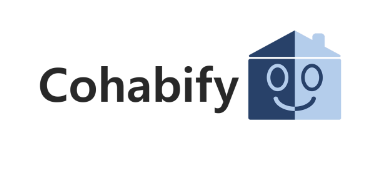

Acuerdo con el Cliente
---

<table>
    <tbody>
        <tr>
            <td rowspan=2>

 Urquijo Martínez, Álvaro (editor)

 Morato Navarro, Olegario (revisor)

 Márquez Sierra, María (revisora)

            </td>
        </tr>
    </tbody>
</table>

<table>
  <tr>
    <th>Grupo</th>
    <th>4</th>
    <th>Entregable</th>
    <th>WPL</th>
  </tr>
  <tr>
    <td>Repositorio</td>
    <td colspan="3"><a href="https://github.com/Cohabify/Cohabify">https://github.com/Cohabify/Cohabify</a></td>
  </tr>
</table>

## Tabla de versiones

| Versión | Cambios | Autores |
| --- | --- | --- |
| V1.0 | Creación del documento | Álvaro Urquijo Martínez |
|V2.0 | Actualización con pricing | Álvaro Urquijo Martínez |

## Tabla de contenidos
- [Tabla de contenidos](#tabla-de-contenidos)
- [Tabla de revisiones](#tabla-de-revisiones)
- [Acuerdo con el Cliente](#acuerdo-con-el-cliente)
- [1. Aceptación de términos](#1-aceptación-de-términos)
- [2. Descripción del servicio](#2-descripción-del-servicio)
- [3. Uso del servicio](#3-uso-del-servicio)
- [4. Cuentas de usuario](#4-cuentas-de-usuario)
- [5. Política de privacidad](#5-política-de-privacidad)
- [6. Pagos](#6-pagos)
- [7. Pricing](#7-pricing)
- [8. Propiedad Intelectual](#8-propiedad-intelectual)
- [9.  Terminación](#9-terminación)
- [10. Limitación de Responsabilidad](#10-limitación-de-responsabilidad)
- [11. Validez y revisión del acuerdo](#11-validez-y-revisión-del-acuerdo)
- [12. Ley Aplicable](#12-ley-aplicable)
- [13. Información de Contacto](#13-información-de-contacto)

## Tabla de revisiones

| Última revisión/vigor | Próxima revisión | Periodo de revisión |
| --- | --- | --- |
| 01/09/2024 | 01/09/2025 | Anual |

## Acuerdo con el Cliente
¡Bienvenido a Cohabify!

Este Acuerdo está realizado entre Cohabify, al que en adelante nos referiremos como "Nosotros" o "Nuestro", y la entidad que usted representa, que en adelante será referida como "usted" o "su/sus". Este Acuerdo contiene los términos y condiciones relacionados con el uso de nuestro servicio y producto. La aceptación de este acuerdo es necesaria para completar el proceso de registro.

Por favor, léalo cuidadosamente.

### 1. Aceptación de Términos
Este Acuerdo describe los términos bajo los cuales se le proporciona a usted el servicio.
Para acceder a todas las características que ofrecemos, deberá leer este Acuerdo y aceptar sus condiciones en su totalidad.

### 2. Descripción del Servicio
Cohabify ofrece la oportunidad de buscar y encontrar personas para compartir alojamiento según sus preferencias personales, así como aficiones o pasatiempos. Esto se obtiene mediante la publicación de anuncios de personas y viviendas.
 El Servicio puede ser actualizado, ampliado o limitado a medida que lo veamos necesario, pero siempre con aviso previo y ofreciendo la posibilidad de retirar nuestro servicio en el caso de que no estuviera de acuerdo con los cambios realizados.

### 3. Uso del Servicio
Usted acepta utilizar el servicio únicamente para fines lícitos y de acuerdo con este Acuerdo.
Usted es responsable de todas las actividades realizadas por su cuenta.

### 4. Cuentas de Usuario
Para acceder a este servicio, es posible que se le pida que cree una cuenta. Usted acepta proporcionar información precisa y completa y mantener esta información actualizada.

### 5. Política de Privacidad
Su privacidad es importante para nosotros. Nuestra [Política de Privacidad](https://github.com/Cohabify/CohabifyDocumentation/blob/S2/S2_markdown/4-PrivacyPolicy.md), explica cómo recopilamos, usamos y protegemos su información personal.

### 6. Pagos
Si el servicio requiere pago, usted acepta pagar todas las tarifas aplicables según se describe en el sitio web del Servicio o dentro del Servicio. Todas las tarifas son no reembolsables, excepto según se disponga expresamente en este Acuerdo.

### 7. Pricing
El servicio consta de 3 planes con diferentes prestaciones:
  - Básico(Gratis): Te permite ver publicaciones ilimitadas y tener 3 chats activo, personalizar tu perfil y publicarte como buscador de piso.
  - Explorador(5€): Te permite tener chats ilimitados, verificar tu perfil además de darte acceso anticipado.
  - Propietario(15€): Te permite publicar viviendas, consultar tus estadísticas de propietario, además incluye una promoción gratuita (A partir de la primera vivienda publicada se cobrarán 5€ extra por vivienda)

Además de estos planes, se permite la opción de promocionar una de tus publicaciones por 3€.

Estos precios podrían ser modificados, en el caso de que fuera necesario, se avisaría a los usuarios con 7 días de antelación a estos cambios.

### 8. Propiedad Intelectual
Todo el contenido y materiales proporcionados en el Servicio son propiedad intelectual de Cohabify o sus licenciantes y están protegidos por las leyes de derechos de autor y otras leyes de propiedad intelectual.

### 9. Terminación
Este Acuerdo puede ser terminado por cualquiera de las partes si la otra parte incumple alguna de las cláusulas acordadas contenidas en el documento.

### 10. Limitación de Responsabilidad
Cohabify no aceptará responsabilidad por cualquier mal uso de la aplicación por parte de los usuarios. Los usuarios son responsables del correcto uso del servicio.

### 11. Validez y revisión del Acuerdo

El presente acuerdo es válido a partir de la fecha de entrada en vigor aquí descrita y es válido hasta nuevo aviso. Este Acuerdo debe revisarse como mínimo una vez por año fiscal; la fecha de revisión será la misma que la fecha de entrada en vigor. Mientras no se realice una revisión, el Acuerdo seguirá siendo válido.

El Cohabify (“Propietario del documento”) es responsable de facilitar revisiones periódicas de este documento. El contenido de este documento puede modificarse según sea necesario, siempre que se obtenga un acuerdo mutuo de las partes interesadas principales y se comunique a todas las partes afectadas. El propietario del documento incorporará todas las revisiones posteriores y obtendrá acuerdos/aprobaciones mutuas según sea necesario.

En caso de cualquier cambio en este Acuerdo, los usuarios serán notificados con 7 días de antelación a los cambios y se les dará la opción de aceptarlos. En caso de no estar de acuerdo con alguno de los cambios, usted podrá optar por dejar de utilizar nuestros servicios.

### 12. Ley Aplicable
Este Acuerdo estará regido por las leyes de España, excepto si infringe los derechos del consumidor en su lugar de residencia.

### 13. Información de Contacto
Si tiene alguna pregunta sobre este Acuerdo, contáctenos en cohabify.soporte@gmail.com

Para acceder a Cohabify, debe reconocer que ha leído, entendido y acepta quedar ligado por este Acuerdo marcando la casilla de verificación antes de registrarse en esta aplicación.
